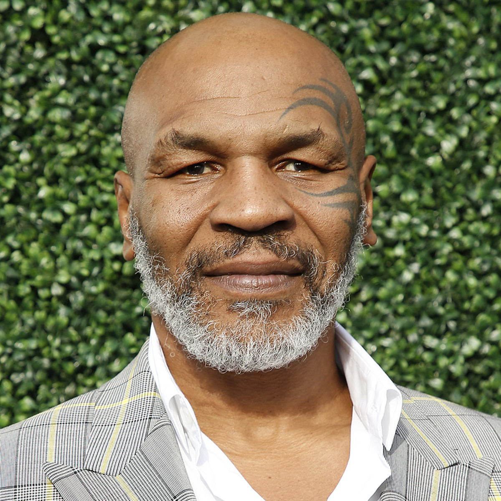

# Lithp: A LISP - Inspired by the bravery and courage of Mike Tyson

## Learning the C language while building a LISP
- [Build Your Own LISP](https://buildyourownlisp.com/)
- [C Reference](https://en.cppreference.com/w/c)
